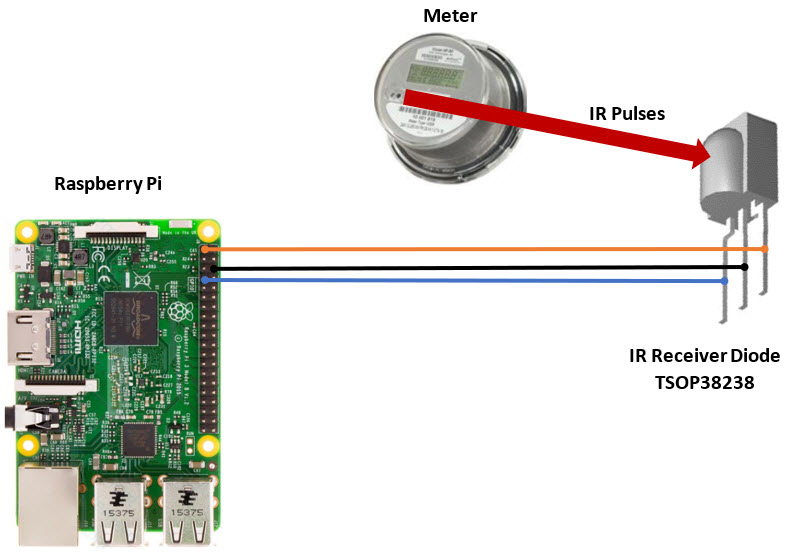

# Home Power Monitor

Monitoring the Electrical Meter

The big problem is filtering out the sun, which shines directly behind my meter in the afternoon.
I made a light-proof cover for the meter. It has a hinge so the meter-reader can lift it.

I need to work on the mechanics/circuit to filter out the sun. I know it can be done because
the commercial reader device does it.

## My public adafruit.io feed

The Pi reports the number of pulses counted every 10 seconds. 

https://io.adafruit.com/topher_cantrell/feeds/power-monitor

## Links

Good general discussion: 
https://learn.openenergymonitor.org/electricity-monitoring/pulse-counting/introduction-to-pulse-counting

Sparkfun IR Receiver Diode: 
https://www.sparkfun.com/products/10266 
https://www.sparkfun.com/datasheets/Sensors/Infrared/tsop382.pdf

Manual for my meter: 
TODO

## Schematic

